# MerkleTree

## 初始化

```
# 构建一颗Merkle树
mt = MerkleTree()
# 构建数据 -> nodeData
nodeData = []
# 构建一棵树，方法选择 imbalance
mt.build_merkle_tree(nodeData, way='imbalance')
# 展示
mt.show()
```
<div align=center>
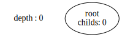
</div>

## 增加
```
# 随机构建一个数据
num = random.randint(1,99)
# 添加到树中
mt.add(str(num))
# 展示
mt.show()
```
<div align=center>
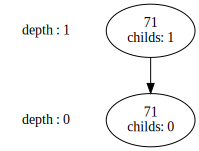
</div>

```
# 多添加一些节点，构造 10 个节点
for _ in range(10):
    num = random.randint(1,99)
    mt.add(str(num))

# 展示
mt.show()
```
<div align=center>
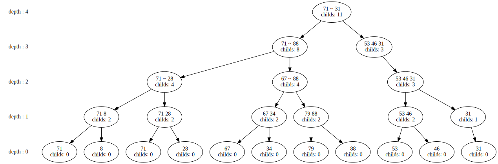
</div>

我们看到了，一棵“枝繁叶茂”的树。我们可以在树中标记出新增的节点，最近一次新增加的节点使用红色进行标注，如下图所示：

```
mt.compare()
```
<div align=center>
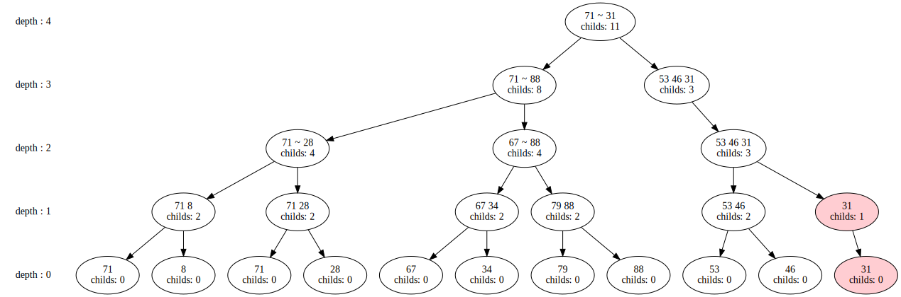
</div>

图中显示最右边的两个节点为最后一次添加到树中的。我们还可以显示每一次添加节点的情况，同一批加入的节点标注为某一个颜色(纵向)。

<div align=center>
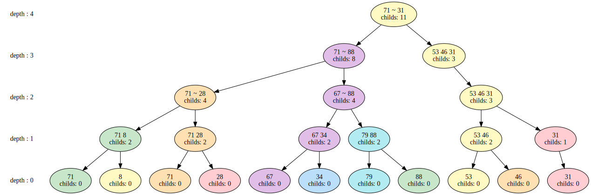
</div>

## 查询

通过不断地增加节点，我们就可以拥有一棵很茂盛的树    
有时是我们会在这棵树上进行查询的工作，有两个方面：
- 证明一个数据是不是存在
- 证明一个数据是不是不在

分析：
本科学习密码学的时候接触到了 RSA。其中，安全性的关键在于 大素数 $P$ 的因数分解    
我们想要验证一个数是不是这个 $P$ 的因数，很容易；但是想要拆分出这个大素数的所有因数是很困难的。 
所以，我就想使用这个方法：
- 为每一个 “叶子” 随机生成一个素数
- 自下而上的，父节点的 “数” 为子节点 “数” 的乘积。

PS：上一回使用这个思路是在做 **Leetcode 49. 字母异位词分组** 的时候

```
# 获取整棵树所有数据自己的素数id
mt.getTreePrime()

# ['227', '331', '797', '941', '877', '191', '173', '577', '563', '409', '353']

# 根据知道的素数id 就可以
mynode, proofPath = mt.search(mt.getTreePrime()[5])

# 展示
mt.show(mynode)
```
<div align=center>
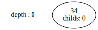
</div>

proofPath 变量中存放着证明这个节点真实存在的 **Merkle 路径**

## Merkle 路径验证

```
# 验证一下路径是否满足条件
mt.merkle_path(proofPath)
```
<div align=center>
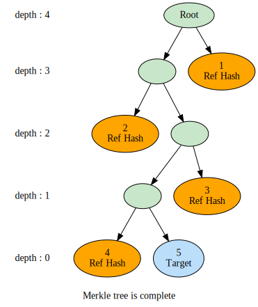
</div>

颜色解释：
- 橙色：表示需要提供给 “请求者” 的作证 hash 值
- 蓝色：“请求者” 想要证明存在的节点
- 绿色：hash 值验证成功的节点

当我们将橙色的节点们发送给 “请求者” 的时候，可能会遇到 数据被篡改 的情况。  
这时候，我们可以再次验证

```
# 篡改第 3 号节点的 hash 数据
proofPath_2 = mt.tampering_test(proofPath,2)

# 验证一下
mt.merkle_path(proofPath_2)
```
<div align=center>
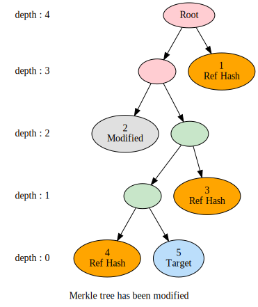
</div>

## 删除
当树中的数据不再需要的时候，留着它会占用位置，但是如果删除掉其中某个数据，再重新建树，需要计算大量的hash运算    
为了避免这个问题，我们这棵树可以删除需要删除的节点
```
# 删除这棵树的一个节点
mt.remove(mt.getTreePrime()[4])
mt.show()
```
<div align=center>
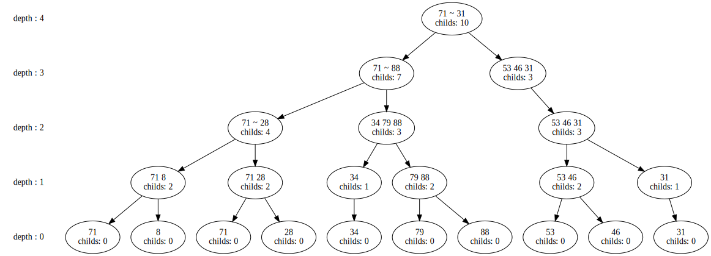
</div>

删除操作之后的，我们看到了第4个节点已经被删除了   
我们还可以继续进行删除或者添加节点

```
# 连续五次删除第3个节点
for i in range(5):
    mt.remove(mt.getTreePrime()[2])
mt.show()
```

<div align=center>
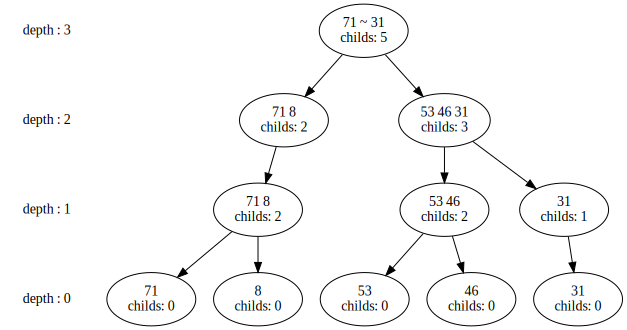
</div>

删除节点这棵树仍会维持满足条件的最小高度。我们可以继续检查一下整棵树的 hash 值是否维持正确。

<div align=center>
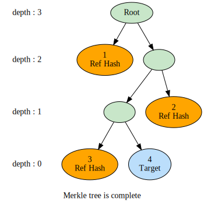
</div>